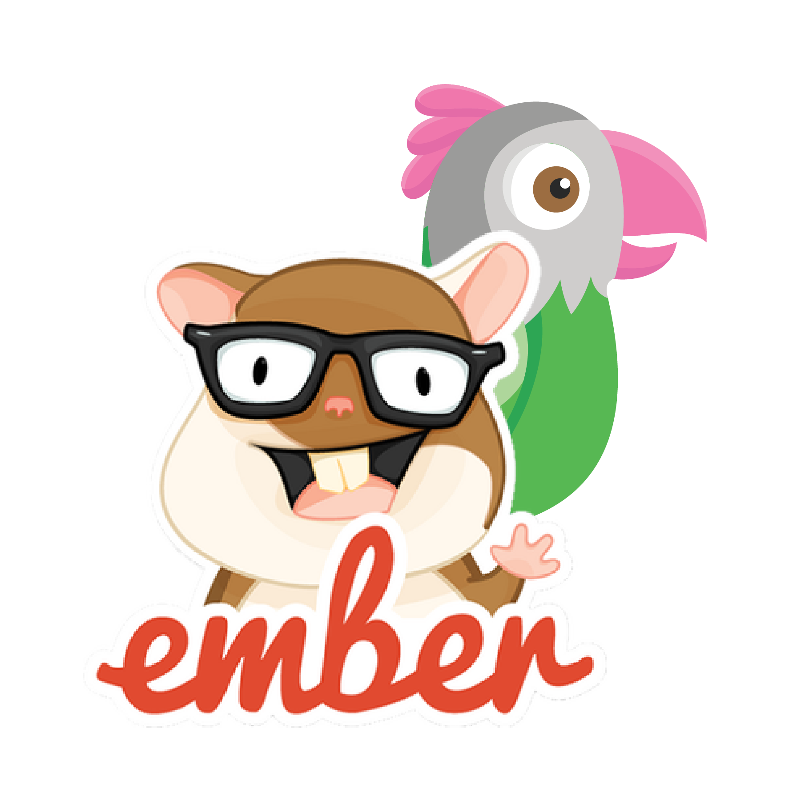

<p align="center">
    
</p>

## Features
- Documented and self-explaining methods
- Small size without any external libraries
- All Javascript API methods are available
- Maintained by the [tawk.to](https://www.tawk.to]) team

<br/>

## Installation
The plugins are available from the node and yarn package managers.
```bash
# Node
npm install @tawk.to/tawk-messenger-ember

# Yarn
yarn add @tawk.to/tawk-messenger-ember
```

<br/>

## Quickstart
Add **TawkMessenger** component in your handlebar file. The **propertyId** and **widgetId** will
be found on your tawk.to Dashboard.

Log in to your account and go to **Administration > Channels > Chat Widget**.

```hbs
<TawkMessenger
    @propertyId={{'property_id'}}
    @widgetId={{'widget_id'}}/>
```

<br/>

## Documentation

This project includes a `docs` folder with more details on the following:
1.  [How to Use](docs/how-to-use.md)
1.  [API Reference](docs/api-reference.md)

<br/>

## Other JS frameworks we support
- [Vue Js](https://github.com/tawk/tawk-messenger-vue)
- [React Js](https://github.com/tawk/tawk-messenger-react)
- [Angular Js](https://github.com/tawk/tawk-messenger-angular)


<br/>

## Frequently Asked Questions

**Do you have a knowledge base or article to support implementation?**

Here is our guide for the [Ember.js integration](https://help.tawk.to/article/ember-js )

**Where can I find more information and support?**

Visit our [help center](https://help.tawk.to) or reach out in the chat on our [website](https://tawk.to). Our agents are available to assist you 24/7.

**Where can I submit a suggestion or report a bug?**

Check to see if the issue already exists. If not, open a new issue in the [Issues tab](https://github.com/tawk/tawk-messenger-ember/issues)
